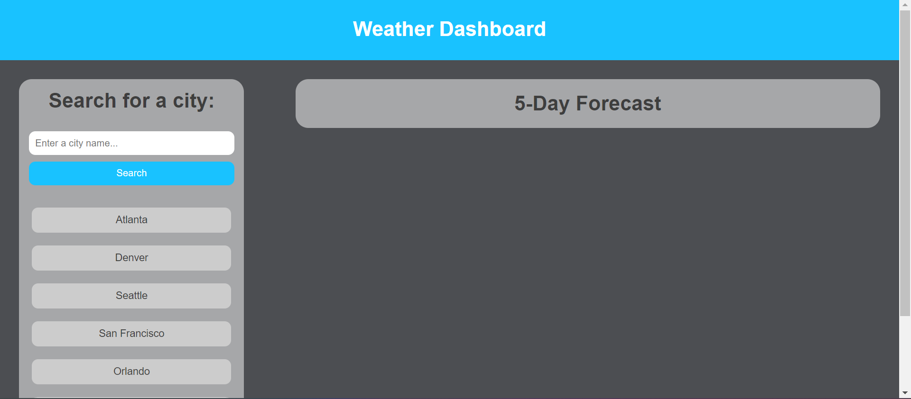
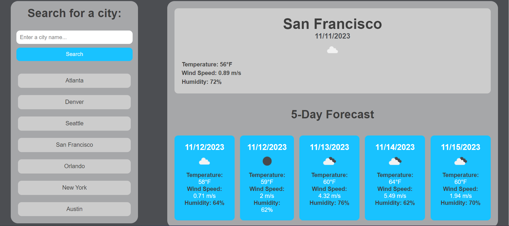
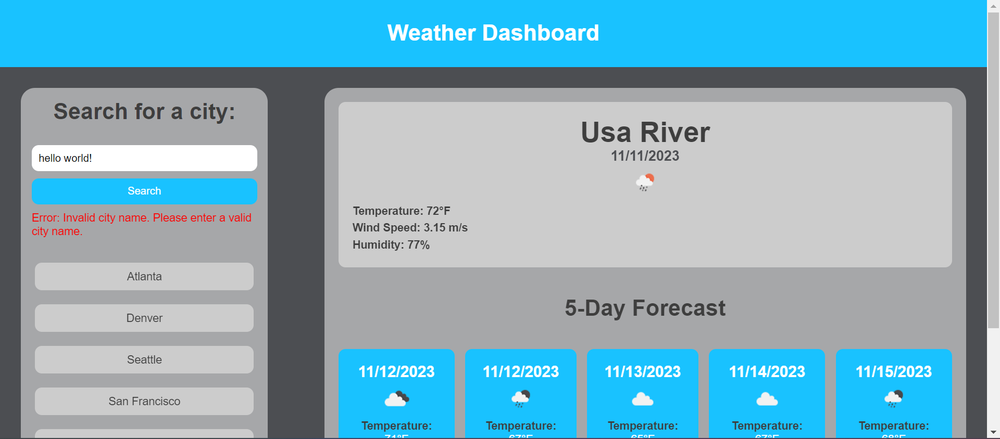

# Weather Dash

## Description
In todays age, checking the weather is a common occurance and even more so for upcoming days. Usually we check the weather for an upcoming trip to make sure our plans are not ruined. This is where this website comes into play. No matter where you're traveling to, any city that you are going to, its weather will be displayed as well as the following five(5) days. That way you don't need to worry about the weather, all the information you need is right here for you.

## Usage
When you first launch the website, you are presented with two main containers:
    1. A left side container with an input box, search button, and list of cities.
        - In the input box you are able to enter a city name, any invalid city name with prompt an error message to please enter a valid city.
        - Once you have decided on the city, you may press the search button or press enter on your keyboard to load the weather forecast.
        - You also have an option of popular cities to check their weather forecasts.
    2. The main container which on first load only shows "5 day forecast".
        - When you enter a valid city name, the current forecast of that city is displaying in the center with the following 5 days forecast for the same city.
        - If you want to change the city, no need to reload you can type it in or pick a different city from the list and their forecast will display instantly.

## Images

## Built With

HTML, CSS, JavaScript, jQuery

## Link
Want to check the weather, use this [link]() to check it out.
